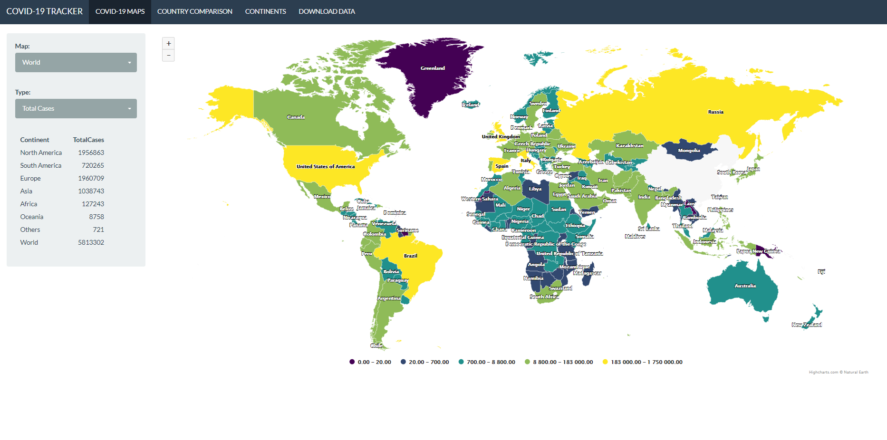
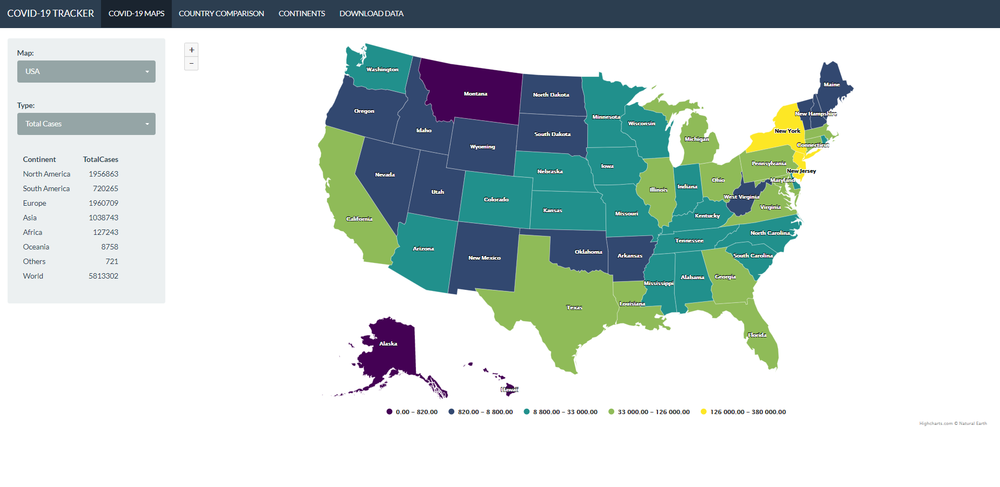
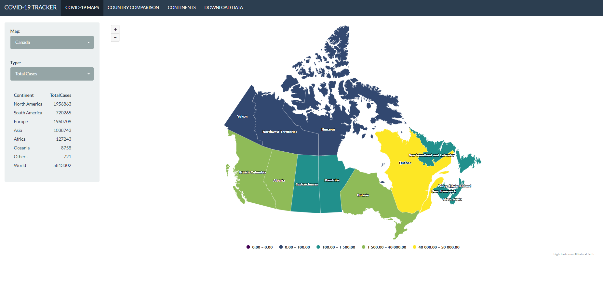
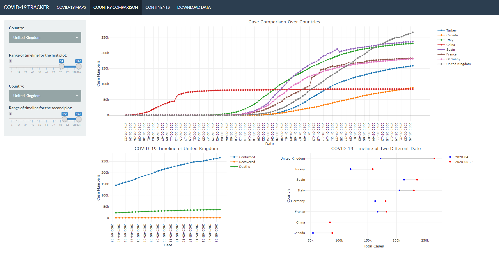
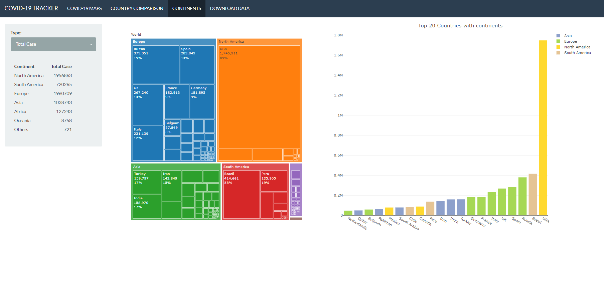
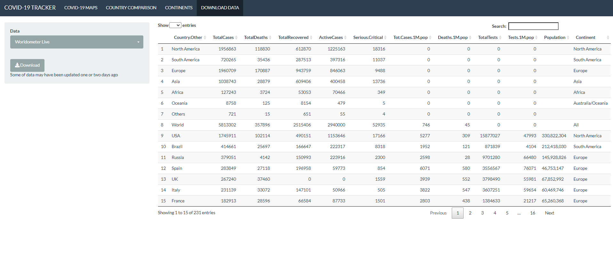

# COVID-19-DASHBOARD-Rshiny

You can go shiny web version of this project from [here](https://sdemirhan1320.shinyapps.io/COVID_DASHBOARD/)

## Covid-19 Dashboard by using html data tables.

**You can download and work with my code but don't forget the code may not be able work regularly because of the changes in the structure of the pulled html data.

<h2>Available Maps</h2>

<ul>
  <li>World</li>
  <li>USA</li>
  <li>UK</li>
  <li>Canada</li>
  <li>Australia</li>
  <li>India</li>
  <li>China</li>
  <li>Germany</li>
  <li>İtaly</li>
</ul>  

